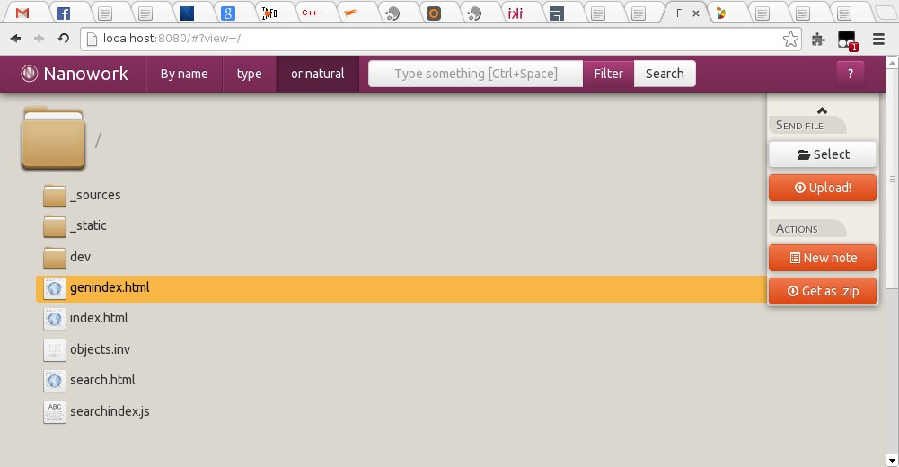
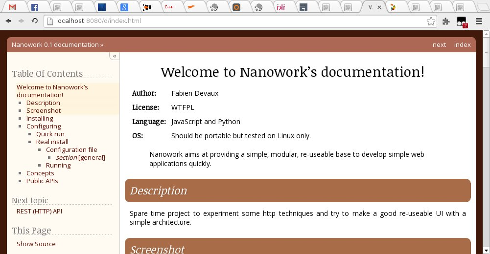
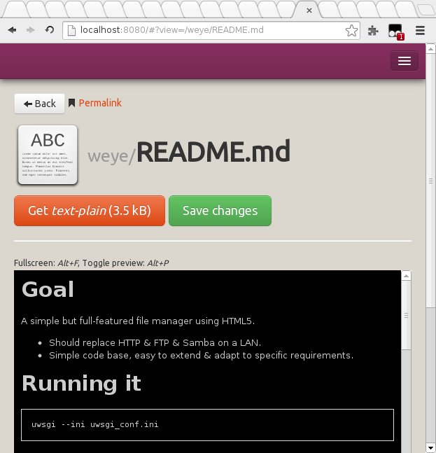

##################################
Welcome to |nw|\ 's documentation!
##################################

:Author: Fabien Devaux
:License: WTFPL
:Language: JavaScript and Python
:OS: Should be portable but tested on Linux only.

.. pull-quote:: |nw| aims at providing a simple, modular, re-usable code base to develop simple web applications quickly.

.. warning:: This project is WIP

    The documentation can be synchronized with reality, sometimes.

Description
###########

Spare time project to experiment some HTTP techniques and try to make a good re-usable UI with a simple architecture.

Screenshots
###########

    Main page (file browser)

.. rst-class:: html-toggle

Show more...
============

    Raw files are accessible conserving path consistency, you can share web sites for instance.

    Rendering on a smaller screen (showing bootstrap feature)

Installing
##########

No installation needed, currently you must use it from the sources folder.
The installation process will come later, with something more like django, to create project folders.

.. pull-quote:: Download `this file <https://github.com/fdev31/weye/archive/master.zip>`_ and then unzip it. You have the sources in a folder now.

Example:

.. code-block:: console
    
    % wget 'https://github.com/fdev31/weye/archive/master.zip' && unzip master

Dependencies
============

Python3
    Refer to your Operating System packaging system or `install it manually <http://python.org/download/>`_

    .. hint:: Python2.6 up to 3.3 is supported

Whoosh
    - install 
    - or run ``hg clone http://bitbucket.org/mchaput/whoosh`` in **src** folder
    - or ``easy_install Whoosh`` / ``pip install Whoosh``
    - or `Download & uncompress <https://pypi.python.org/pypi/Whoosh/#downloads>`_ it and copy the content of the **src** folder to |nw|'s **src**\ 's folder

Quick run
=========

This technique is using :mod:`python:wsgiref`, discouraged for production.

.. parsed-literal::
    
    ./run.py |nanoconf|

You can enjoy `the home page on http://127.0.0.1:8080/ <http://127.0.0.1:8080/>`_ in theory ;)

.. rst-class:: html-toggle

Configuring
###########

Real install
============

The supported method involves uwsgi_. You may have to `download and install it <http://uwsgi-docs.readthedocs.org/en/latest/Install.html>`_.

Configuration file
------------------

Edit |nanoconf|, you'll find explanations below:

.. _weye-conf:

[general]
~~~~~~~~~
.. pull-quote::

    home
        Path of the sources (you cloned or unpacked that folder) (ex: ``/home/toto/temporary/weye.git``).
    shared_root
        Used in file manager, this is the path of the root folder you want *Nanowork* to work on.
    file_encoding
        File encoding of your filesystem (*utf-8* by default).
    no_overwrite    
        Set it to `yes`, `true` or `active` to de-activate overwrite on the server. Uploading new files will still granted if **read_only** is false.
    read_only
        Do not allow any write operation.
    port
        HTTP port to work on, if you run ``uwsgi`` with a proper configuration you may avoid giving the port number (ex: ``:8080``) on the URL to connect to the server.
    host
        The default IP address will only listen on local host, if you want to be accessible from anybody, set it to `0.0.0.0`.
    debug
        Enable or disables debugging informations (currently broken)

[uwsgi]
~~~~~~~
.. pull-quote::

    .. _chdir_opt:

    chdir
        You must chdir to |nw| sources' path for |nw| to work
    http-socket
        The ``ip:port`` you want to enable |nw| on

Running
-------

.. parsed-literal::

    % uwsgi |nanoconf|

.. hint:: You can move and rename the |nanoconf| file of course ! Just think about changing the chdir_opt_ accordingly.

Custom configurations
=====================

You will find a ready to use **WSGI** object under ``weye.application:application``.

.. rst-class:: html-toggle

Concepts (developers corner)
#############################

No time to detail about real concepts, but here is the libs involved: 

- `mustache <http://mustache.github.io/>`_
- `vcs <https://pypi.python.org/pypi/vcs>`_

.. _object_model:

Object model
============

Mandatory
---------

:mime: Some mime type, but instead of slashes you have dashes
:name: The exact file name of the item (used to browse & do queries)
:title: The full name of the item (will be set to `mime` if not set)
:size: The "weight" of the item, some parts expect bytes
:editables: space-separated list of editable fields

Recommended
-----------

:family: An additional family 
:searchable: A pattern that will be used in filter, in place of `title`.

Additional
----------

:thumb: HTML of a thumbnail for that item
:descr: The (short) description of the item
:classes: Additional (html) classes for this item

Custom
------

Custom data can be returned, using a special attribute `data` (list) of  ``{k: <key>, v: <value> }`` on your JSON items.  Ex:

.. code-block:: js

    [
    ['name', 'mime', 'size', 'data'],
    ['Toto', 'guy', 150, [{'k': 'hair', 'v': 'blond'}]]
    ['Tata', 'guri', 120, [{'k': 'hair', 'v': 'red'}, {k:'nails',v:'blue'}]]
    ]

JSON model
==========

Things are returned as collections (Array), to optimize transfers, the format is as follow:

.. code-block:: js

    children = {
        c = ['title', 'mime', 'family', 'searchable'],
        r = [ ['Foobar', 'text-plain', 'text', 'Foobar markdown'] ]
        }

.. pull-quote:: ...this example is suited to :ref:`HTTP_list_children`,

    for :ref:`HTTP_get_object` the property is omitted:

.. code-block:: js

    { c = ['title', 'mime', 'family', 'searchable'],
    r = [ ['Foobar', 'text-plain', 'text', 'Foobar markdown'],
        ['Baz', 'text-javascript', 'text', 'bazjavascript']
     ] }

.. rst-class:: html-toggle

Public APIs
###########

You might be interested in the :ref:`function index <genindex>` as well.

.. toctree::

    dev/httpapi
    dev/jsapi

----

.. raw:: html

    

    
    <noscript>Please enable JavaScript to view the
    <a href="http://disqus.com/?ref_noscript">comments powered by Disqus.</a></noscript>
    <a href="http://disqus.com" class="dsq-brlink">comments powered by Disqus</a>

.. links of the page should go here:

.. _uwsgi: http://projects.unbit.it/uwsgi/
.. |nanoconf| replace:: *sample_config.ini*
.. |nw| replace:: Nanwork

